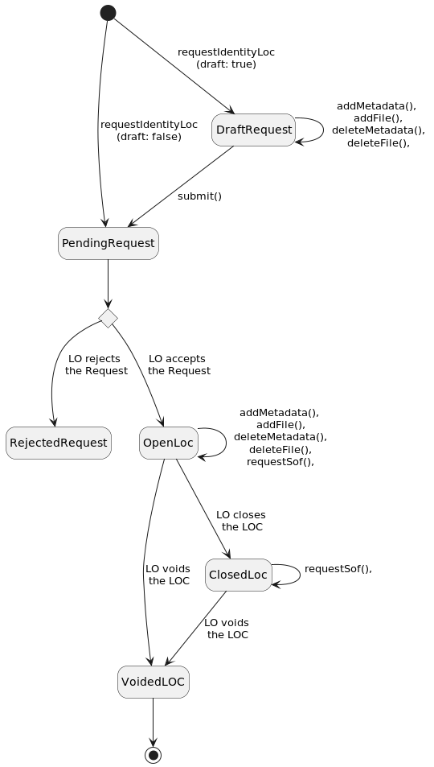

# Legal Officer Case (LOC)

## State

:::note
An [authenticated client](authentication.md) is necessary for all LOC operations.
:::
The global state of LOCs can be obtained (and later on, refreshed) with:

```typescript
const locsState = await client.locsState();
const refreshedState = await locsState.refresh();
```

:::caution
All user operations (`requestTransactionLoc`, `requestCollectionLoc`, etc.), as well as `refresh`, do return a new state.
Always use the most recent state, and discard the former state.
In the example above, the var `locsState` must not be used any more as soon as `refreshedState` is available.
:::

## Transaction LOC

### Lifecycle


### Request

```typescript
const draftRequest = await locsState.requestTransactionLoc({
    legalOfficer: alice,
    description: "This is a Transaction LOC",
    draft: true,
});
```

### Submit
At this stage it's already possible to add [metadata](#metadata) or files, to be published later by the LO.
When done, the request has to be submitted to the LO:

```typescript
const pendingRequest = await draftRequest.submit();
```

Then you have to wait for the LO to open the LOC:

```typescript
const openLoc = await pendingRequest.refresh() as OpenLoc;
```

### Metadata

Metadata can be added to, or removed from, an open LOC:

```typescript title="addMetadata"
openLoc = await openLoc.addMetadata({
    name: "Some name",
    value: "Some value"
});
```

```typescript title="deleteMetadata"
openLoc = await openLoc.deleteMetadata({
    name: "Some name"
});
```

## Collection LOC

### Lifecycle


### Request

A Collection LOC can be requested to a given Legal Officer by providing a description.

```typescript
const draftRequest = await locsState.requestCollectionLoc({
    legalOfficer: alice,
    description: "This is a Collection LOC",
    draft: true
});
```

### Submit
At this stage it's already possible to add [metadata](#metadata) or files, to be published later by the LO.
When done, the request has to be submitted to the LO:

```typescript
const pendingRequest = await draftRequest.submit();
```

Then you have to wait for the LO to open and close the LOC:

```typescript
const openLoc = await pendingRequest.refresh() as OpenLoc;
const closedLoc = await openLoc.refresh() as ClosedCollectionLoc;
```

### Collection Item

When opening the Collection LOC, the LO decides if it supports file upload or not.

#### Collection WITHOUT upload support 

Add an item to the collection:

```typescript title="Add Item"
const itemId = "0xc53447c3d4e9d94d6f4ab926378c5b14bd66e28af619d4dcb066c862f8aeb455"; // SHA256 hash of "first-collection-item" (without the quotes)
const itemDescription = "First collection item";
const itemFileContent = "test";
const itemFileHash = hash(itemFileContent);
closedLoc = await closedLoc.addCollectionItem({
    itemId,
    itemDescription,
    signer: state.signer
});
```

Later on, you can retrieve the item with its ID:

```typescript title="Get an Item"
const item = await closedLoc.getCollectionItem({ itemId });
```

#### Collection WITH upload support 

A collection item may have attached files if the collection permits it. The files are then stored in logion's private IPFS network
ensuring their availability over time. If a controlled delivery for attached files is needed, see "Collection with restricted delivery"
below.

There are 2 possibilities when attaching files to an item:
- immediate upload of the files upon item creation or
- item creation followed by an explicit upload later on.

See the examples below.

```typescript title="Add Item and provide file content"
const firstItemId = hashString("first-collection-item");
const firstItemDescription = "First collection item";
const firstFileContent = "test";
const firstFileHash = hashString(firstFileContent);
closedLoc = await closedLoc.addCollectionItem({
    itemId: firstItemId,
    itemDescription: firstItemDescription,
    signer: state.signer,
    itemFiles: [
        new ItemFileWithContent({
            name: "test.txt",
            contentType: MimeType.from("text/plain"),
            hashOrContent: HashOrContent.fromContent(Buffer.from(firstFileContent)), // Let SDK compute hash and size
        })
    ],
});
```

```typescript title="Add Item and provide hash and size"
const secondItemId = hashString("second-collection-item");
const secondItemDescription = "Second collection item";
const secondFileContent = "test2";
const secondFileHash = hashString(secondFileContent);
closedLoc = await closedLoc.addCollectionItem({
    itemId: secondItemId,
    itemDescription: secondItemDescription,
    signer: state.signer,
    itemFiles: [
        new ItemFileWithContent({
            name: "test2.txt",
            contentType: MimeType.from("text/plain"),
            hashOrContent: HashOrContent.fromHash(secondFileHash), // No content, must upload later
            size: 5n, // No content, must provide size
        })
    ]
});
```

```typescript title="Upload file for an existing item"
closedLoc = await closedLoc.uploadCollectionItemFile({
    itemId: secondItemId,
    itemFile: new ItemFileWithContent({
        name: "test2.txt",
        contentType: MimeType.from("text/plain"),
        hashOrContent: HashOrContent.fromContent(Buffer.from(firstFileContent)),
    }),
});
```

#### Collection with restricted delivery

A collection item with restricted delivery requires a token definition i.e. the "address" of the token
which opens access to the underlying files when owned. Below an example where the underlying files
will be delivered to the owner of an ERC-721 token on Ethereum Mainnet.

```typescript title="Add Item with restricted delivery"
const firstItemId = generateEthereumTokenItemId("202210131750", "4391");
const firstItemDescription = "First collection item";
const firstFileContent = "test";
const firstFileHash = hashString(firstFileContent);
const firstItemToken: ItemTokenWithRestrictedType = {
    type: "ethereum_erc721",
    id: '{"contract":"0x765df6da33c1ec1f83be42db171d7ee334a46df5","id":"4391"}'
};
closedLoc = await closedLoc.addCollectionItem({
    itemId: firstItemId,
    itemDescription: firstItemDescription,
    signer: state.signer,
    itemFiles: [
        new ItemFileWithContent({
            name: "test.txt",
            contentType: MimeType.from("text/plain"),
            hashOrContent: HashOrContent.fromContent(Buffer.from(firstFileContent)),
        })
    ],
    itemToken: firstItemToken,
    restrictedDelivery: true,
});
```

:::danger
In the above example, the item ID is generated using function `generateEthereumTokenItemId`. This ensures that the item ID
matches the one computed by the [logion Smart Contract](https://github.com/logion-network/logion-solidity/blob/main/contracts/Logion.sol).
**This is very important because otherwise, the bidirectional link between the item and its token would be broken.
The nonce parameter must match the one in the Smart Contract.**

One may consider not using the logion Smart Contract, leaving the choice of the item ID completely open, but this is not recommanded.
:::

This is the list of supported token types:
- `ethereum_erc721`
- `ethereum_erc1155`
- `goerli_erc721`
- `goerli_erc1155`

With the above types, the `id` field must represent a valid JSON object with 2 fields: `contract` and `id`. Both fields are strings.

`contract` is the address of the Smart Contract of the token.

`id` is the token ID as assigned by the Smart Contract.

#### Terms and Conditions

Terms and conditions can be added to the collection item, using either the `LogionClassification`,
a set of `SpecificLicense`s, or both.

As a prerequisite, a valid closed Transaction LOC defining the classification or license must exist.
(referred as `logionClassification.locId` and `specificLicense.locId` in the example below).

```typescript
const itemId = "0xc53447c3d4e9d94d6f4ab926378c5b14bd66e28af619d4dcb066c862f8aeb455"; // SHA256 hash of "first-collection-item" (without the quotes)
const itemDescription = "First collection item";
const itemFileContent = "test";
const itemFileHash = hash(itemFileContent);
closedLoc = await closedLoc.addCollectionItem({
    itemId,
    itemDescription,
    signer: state.signer,
    logionClassification: new LogionClassification(logionClassificationLocRequest.locId, {
        regionalLimit: [ "BE", "FR", "LU" ],
        transferredRights: [ "PER-PRIV", "REG", "TIME" ],
        expiration: "2025-01-01",
    }),
    specificLicenses: [ new SpecificLicense(specificLicense.locId, "Some details about the license") ]
});
```

:::note Logion Classification
* The Logion Classification allows to define a set of `transferredRights` to define precisely the scope of the terms and conditions.
All possible transferred rights are available in `logionLicenseItems`.
* With the code `TIME` it is possible to limit the right in time by setting the parameter `expiration`.
* With the code `REG` it is possible to limit to some countries/regions with the parameter `regionalLimit`.
:::

## Identity LOC

Except for the request, described here, everything else is similar to the [Transaction LOC](#transaction-loc).

### Lifecycle



### Request

An Identity LOC is requested this way:

```typescript
const draftRequest = await locsState.requestIdentityLoc({
    legalOfficer: alice,
    description: "This is an Identity LOC",
    userIdentity: {
        email: "john.doe@invalid.domain",
        firstName: "John",
        lastName: "Doe",
        phoneNumber: "+1234",
    },
    userPostalAddress: {
        line1: "Peace Street",
        line2: "2nd floor",
        postalCode: "10000",
        city: "MyCity",
        country: "Wonderland"
    },
    draft: true
});
```

### Submit
At this stage it's already possible to add [metadata](#metadata) or files, to be published later by the LO.
When done, the request has to be submitted to the LO:

```typescript
const pendingRequest = await draftRequest.submit();
```

## Query

### Querying requests
Pending and rejected requests can be queried:

```typescript
const type: LocType = 'Transaction'; // could be 'Collection' or 'Identity'
const pendingRequests = locsState.pendingRequests[type];
const rejectedRequests = locsState.rejectedRequests[type];
```

### Querying LOCs
Similarly, LOC's can be queried according to their state:

```typescript
const type: LocType = 'Transaction'; // could be 'Collection' or 'Identity'
const openLocs = locsState.openLocs[type];
const closedLocs = locsState.closedLocs[type];
const voidedLocs = locsState.voidedLocs[type];
```

## Accessing LOC data

```typescript
const locData: LocData = locsState.openLocs["Identity"][0].data();
const userIdentity = locData.userIdentity;
console.log("Identity of %s: %s %s %s %s", 
    locData.requesterAddress, 
    userIdentity?.firstName, 
    userIdentity?.lastName, 
    userIdentity?.email, 
    userIdentity?.phoneNumber
);
```

