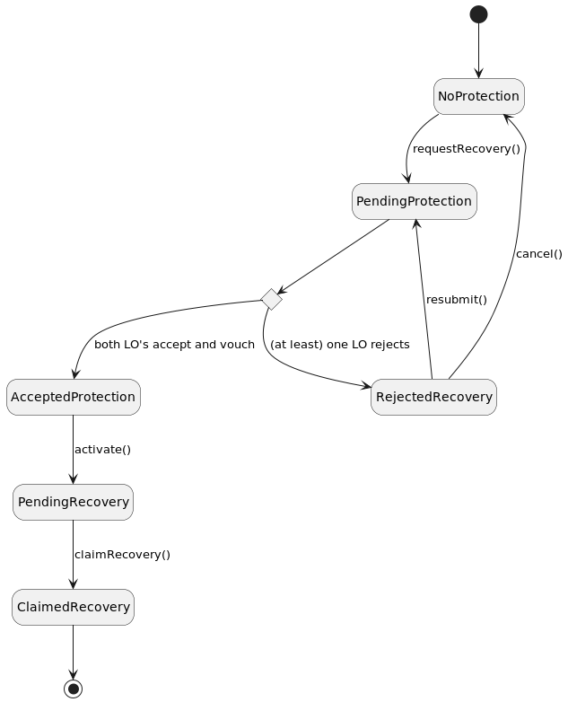

# Protection and Recovery

## State

:::note
An [authenticated client](authentication.md) is necessary for protection/recovery operations.
:::
The global state of protection or recovery can be obtained (and later on, refreshed) with:

```typescript
const protectionState = await authenticatedClient.protectionState();
const refreshedState = await protectionState.refresh();
```

:::caution
All user operations (`activateProtection`), as well as `refresh`, do return a new state.
Always use the most recent state, and discard the former state.
In the example above, the var `protectionState` must not be used any more as soon as `refreshedState` is available.
:::

## Protection

The setup of a Polkadot account protection is a 2-steps process:
* **Choose 2 officers** among the official list of Logion Legal Officers.
* **activate** the protection on-chain given a valid (i.e. closed and non-void) Identity LOC with each LLO.

### Choose LLOs and LOCs

For below example to work, you will need a valid Identity LOC with both alice and bob.

```typescript
const legalOfficers = authenticatedClient.getLegalOfficers();
const locsState = await authenticatedClient.locsState();

const alice = authenticatedClient.getLegalOfficer("5GrwvaEF5zXb26Fz9rcQpDWS57CtERHpNehXCPcNoHGKutQY");
const bob = authenticatedClient.getLegalOfficer("5FHneW46xGXgs5mUiveU4sbTyGBzmstUspZC92UhjJM694ty");
const aliceLoc = locsState.closedLocs.Identity.find(
    loc => loc.data().ownerAddress === alice.address
        && loc.data().voidInfo === undefined
);
const bobLoc = locsState.closedLocs.Identity.find(
    loc => loc.data().ownerAddress === bob.address
        && loc.data().voidInfo === undefined
);
```

### Activate your protection

```typescript
const noProtection = await authenticatedClient.protectionState() as NoProtection;
const pending = await noProtection.activateProtection({
    payload: {
        legalOfficer1: alice,
        legalOfficer2: bob,
        requesterIdentityLoc1: aliceLoc,
        requesterIdentityLoc2: bobLoc,
    },
    signer,
});
```

## Vault
Operations require an activated protection (see above).

### Transfer from vault

```typescript
let activeProtection = (await authenticatedClient.protectionState()) as ActiveProtection;

let vaultState = await activeProtection.vaultState();
const vaultAddress = vaultState.vaultAddress;
vaultState = await vaultState.createVaultTransferRequest({
    legalOfficer: alice,
    amount: new PrefixedNumber("1", NONE),
    destination: REQUESTER_ADDRESS,
    signer
});
const pendingRequest = vaultState.pendingVaultTransferRequests[0];
```

### Transfer to vault

A transfer to the vault is similar to any other [transfer](balance-transactions#transfer).
Simply use `vaultState.vaultAddress` as destination.

### Check vault balance

You must fist wait for one Legal Officer acceptance, and then see the effect of the transfer on the vault balance:

```typescript
vaultState = await vaultState.refresh();

const balance = vaultState.balances[0];
console.log("Balance :%s", `${balance.balance.coefficient.toInteger()}.${balance.balance.coefficient.toFixedPrecisionDecimals(2)}${balance.balance.prefix.symbol}`)
```

## Recovery

In order to recover a previously protected account, you must first create a new Polkadot account. Then follow these 3-stpes process:
* **Request a recovery** to the Legal Officers who protected the lost account.
* Upon acceptance and vouching of the recovery, **activate** the protection (of the new account) on the chain.
* **Claim** the recovery.

One claimed, you can recover the lost assets.

### Overview of the whole process



### Request a recovery

Recovery must be requested to the **same Legal Officers** who accepted to protect the lost account (in this case, Alice and Bob).

```typescript
const noProtection = await authenticatedClient.protectionState() as NoProtection;
const pending = await noProtection.requestRecovery({
    payload: {
        recoveredAddress: REQUESTER_ADDRESS,
        legalOfficer1: alice,
        legalOfficer2: bob,
        requesterIdentityLoc1: aliceLoc,
        requesterIdentityLoc2: bobLoc,
    },
    signer,
});
```

### Activate the new protection

You must first wait for LO's acceptance and vouching, and then activate the new protection:

```typescript
const accepted = (await pending.refresh()) as AcceptedProtection;

let pendingRecovery = await accepted.activate(signer) as PendingRecovery;
```

### Claim the recovery

Finally, the recovery is claimed:

```typescript
pendingRecovery = await pendingRecovery.waitForFullyReady();
const claimed = await pendingRecovery.claimRecovery(signer);
```

### Recover the lost balance

```typescript
const recoveredBalance = await claimed.recoveredBalanceState();
await recoveredBalance.transfer({
    signer,
    destination: NEW_ADDRESS,
    amount: recoveredBalance.balances[0].available,
});
```

:::info
The destination may be any address, not necessarily the new account address.
:::

### Recover the lost vault

As for any transfer from a vault, you must wait for one LO's approval.

```typescript
const newVault = await claimed.vaultState();
let recoveredVault = await claimed.recoveredVaultState();
recoveredVault = await recoveredVault.createVaultTransferRequest({
    legalOfficer: alice,
    amount: recoveredVault.balances[0].available,
    destination: newVault.vaultAddress,
    signer,
});

// ... Wait for LO's acceptance ...
newVault = await newVault.refresh();

// Check Vault balance
const newBalance = newVault.balances[0];
console.log("Balance :%s", `${newBalance.balance.coefficient.toInteger()}.${newBalance.balance.coefficient.toFixedPrecisionDecimals(2)}${newBalance.balance.prefix.symbol}`);
```

:::info
The destination may be any address, not necessarily the new vault address.
:::

### Rejection Management

If rejected by one or more Legal Officer, you may either
* Resubmit the request to the officer who rejected,
* Or completely cancel your recovery request.

```typescript title="Resubmit to LO who rejected"
let rejectedRecovery = (await authenticatedClient.protectionState()) as RejectedRecovery;
const rejecter = rejectedRecovery.protectionParameters.states.find(state => state.status === "REJECTED")!.legalOfficer;
rejectedRecovery.resubmit(rejecter);
```

```typescript title="Cancel the recovery request"
let rejectedRecovery = (await authenticatedClient.protectionState()) as RejectedRecovery;
rejectedRecovery.cancel();
```
