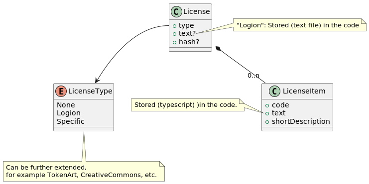

# Scope of Rights

## Model



## LOCS

### LOC Holding the License definition 
* 1 LOC per license type - currently one LOC is foreseen for the type `Logion`.
* Each nomenclature item right is defined by one Metadata added to the LOC.
  * `name`: `shortDescription` of the license item, for instance "RIGHT TO REPRODUCE/COPY" or "RIGHT TO REPRESENT/TO PUBLICLY DISPLAY/TO PERFORM"
  * `value`: the `hash` of the text of the item.
* In order to insure those item texts are publicly available, they are stored in project TBD (`logion-network/logion-api` or `logion-network/logion-wallet` or a specific repository). 
* The mapping between a license type and LOC ID is set on an environment basis, in `front_config.js`:
```text
license.Logion=20813ce3-0d62-4ab8-8149-23655d67adaa
-- Later:
license.TokenArt=8ddfbcad-64aa-49c2-af92-7302581da9db
license.CreativeCommons=...
```

### LOC referencing a license
* Data storage (in `pallet-logion-loc`: `LegalOfficerCase` and `CollectionItem`) is extended with 2 fields:
  * `license_type`: `None` | `Logion` | `Specific`.
  * `license_items`: list of selected license items, represented by their hashes - populated only for type `Logion`.

## Add a license to a LOC

### Collection LOC : Import via CSV

CSV format is extended with 2 new columns: LICENSE_TYPE, LICENSE_ITEMS

```
ID,DESCRIPTION,FILE NAME,FILE CONTENT TYPE,FILE SIZE,FILE HASH,RESTRICTED,TOKEN TYPE,TOKEN ID,LICENSE_TYPE, LICENSE_ITEMS
programming_music.jpg,Programming Music,programming_music.jpg,image/jpeg,90718,0xa025ca5f086f3b6df1ca96c235c4daff57083bbd4c9320a3013e787849f9fffa,Y,owner,0x590e9c11b1c2f20210b9b84dc2417b4a7955d4e6,None,
lucas_games_characters.jpg,LucasArts Games Characters,lucas_games_characters.jpg,image/jpeg,91880,0x546b3a31d340681f4c80d84ab317bbd85870e340d3c2feb24d0aceddf6f2fd31,N,,TokenArt,"0x123...456,0x789...012,0x444...333,C"
```

* license type is `None` | `Logion` | `Specific`
* license item hashes are validated from LOC files for type `Logion`
* If type is `Specific` - The user receives the suggestion to add a metadata item or a file with the license text or to RTFM.

### Transaction LOC : Import via LOC creation screen
* Drop-down to select license type: `None` | `Logion` | `Specific`
* If type is `Logion` - List of check boxes with items: populated from LOC files.
* If type is `Specific` - Text area to add a (small) text.

## Display license
In SOF or certificate.
When `license-type` is `Logion` the license items are retrieved using the License Holding LOC. 

## Versioning
In case of new version, a new LOC containing the items is published, and the setting is adapted.

## Open issues
* Where to store `Specific` license text ? (given that LOC files are private and metadata limited in size)
* Config-less way of retrieving scope of rights LOC's ? 


